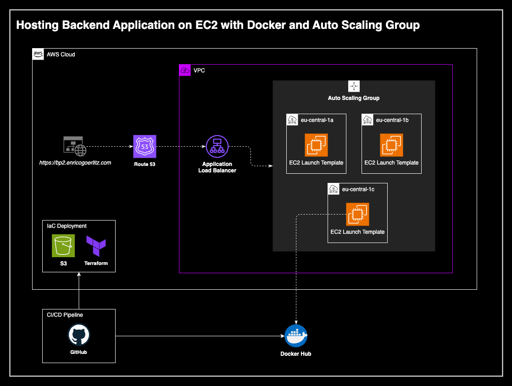

# Basic Project 2 - Hosting Backend Application on EC2 Instances with Auto-Scaling

[](https://github.com/enricogoerlitz/aws-bp-2-hosting-backend-on-ec2-asg-alb/actions/workflows/ci-backend.yml)
[](https://github.com/enricogoerlitz/aws-bp-2-hosting-backend-on-ec2-asg-alb/actions/workflows/cd-backend.yml)
[](https://github.com/enricogoerlitz/aws-bp-2-hosting-backend-on-ec2-asg-alb/actions/workflows/cd-terraform.yml)
[](https://github.com/enricogoerlitz/aws-bp-2-hosting-backend-on-ec2-asg-alb/actions/workflows/cd-terraform-destroy.yml)

<br>

# Architecture

## Description

This project involves hosting a backend application on Amazon EC2 instances with auto-scaling capabilities and accessibility with HTTPS. The setup includes using Docker to containerize the application, Terraform for infrastructure as code, and GitHub Actions for CI/CD pipelines. The architecture leverages the following AWS services:

- **EC2 Instances:** Virtual servers to run the backend application.
- **Auto Scaling Group (ASG):** Automatically adjusts the number of EC2 instances based on the application's load to ensure high availability and reliability.
- **Application Load Balancer (ALB):** Distributes incoming traffic across multiple EC2 instances to balance the load and enhance fault tolerance.
- **Route 53:** Manages domain name system (DNS) settings to route end-user requests to the appropriate resources.
- **Certificate Manager:** Provides SSL/TLS certificates to enable secure HTTPS connections to the application.
- **EC2 Launch Template:** Defines the configuration for EC2 instances, including a custom user script to start the Docker container using Docker Compose.
- **S3:** Used for storing Terraform state files securely.
- **IAM:** Manages access and permissions for AWS services and resources, including OpenID Connect (OIDC) for GitHub Actions.

<br>



<br>

# Workingtasks

## 1. Setup basic flask app

**Commands**
```bash
$ python -m venv venv
$ python -m unittest ./tests/test_app.py
```

## 2. Setup docker

**Commands**
```bash
$ cd docker/dev
$ docker-compose up -d

$ docker build --platform linux/amd64/v2 -t enricogoerlitz/bp2-backend-amd64v2 -f ./docker/Dockerfile .
$ docker push enricogoerlitz/bp2-backend-amd64v2:latest
```

## 3. Configure Project in Console

## 4. Setup Code CI/CD

### Pipeline

**push on dev:**

- run unittests

<br>

**pull request on main**

- run unittests
- if unittests green -> build and deploy docker image on hub.docker.com

## 5. Create IaC Scripts

## 6. Setup IaC Deployment Pipeline with Terraform and S3

[Reference Link](https://www.youtube.com/watch?v=GowFk_5Rx_I&ab_channel=CloudScalr)

### Pipeline

**pull request on main**

- deploy infrastructure with terraform

<br>

**pull request on destroy-infra**

- destroy infrastructure with terraform

<br>

### AWS Auth Configuration (OpenID Connect)

1. aws > IAM > Identity Provider > new Identity Provider
    - url=https://token.actions.githubusercontent.com
    - audience=sts.amazonaws.com


2. aws > s3 > create bucket
    - name
    - enable enrcyption

3. aws > IAM > roles > create role > custom trusted policy

4. GitHub Secrets:
    - AWS_BUCKET_NAME=bp2-terraform-deployment-state
    - AWS_BUCKET_KEY_NAME=infra.tfstate
    - AWS_REGION=eu-central-1
    - AWS_ROLE=arn:aws:iam::533267024986:role/github-oicd-bp2-terraform-deployment-role
